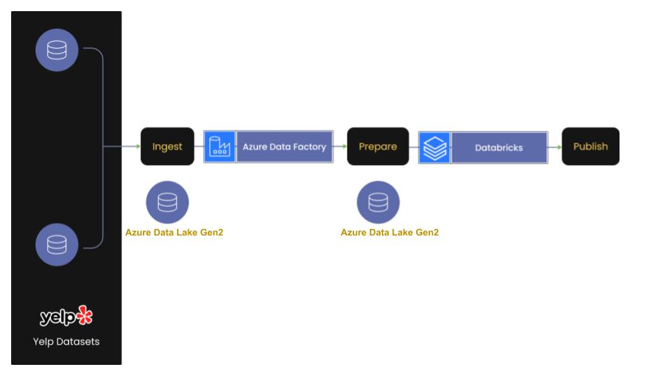

# Analyze Yelp Dataset Using Spark On Azure Databricks
Data Analysis on yelp datasets using PySpark on Azure Databricks

## Introduction
Yelp is a community review site and an American multinational firm based in San Francisco, California. It publishes crowd-sourced reviews of local businesses as well as the online reservation service Yelp Reservations. Yelp has made a portion of their data available in order to launch a new activity called the Yelp Dataset Challenge, which allows anyone to do research or analysis to find what insights are buried in their data. Due to the bulk of the data, this project only selects a subset of Yelp data in a zip file named 'dataset.zip,' which comprises three JSON files, including 'business.json', which provides business data such as location data, attributes, and categories.

## Architecture

## Tech Stack
1. Programming Language: Python3, PySpark
2. Azure Cloud:
   - Data Factory
   - Databricks
   - ADLS Gen2
  
## Data used
URL: https://www.yelp.com/dataset

## Approach
-   Read yelp datasets in ADLS and convert JSON to parquet for better performance.

-   Convert JSON to Delta Format.

-   Total records in each dataset.

-   Partition tip dataset tip by a date column.

-   Find the top 3 users based on their total number of reviews.

-   Find the top 10 users with the most fans

-   Analyse the top 10 categories by a number of reviews.

-   Analyse top businesses which have over 1000 reviews.

-   Analyse Business Data: Number of restaurants per state.

-   Analyze the top 3 restaurants in each state.

-   List the top restaurants in a state by the number of reviews.

-   Numbers of restaurants in Arizona state per city.

-   Broadcast Join: restaurants as per review ratings in a city in Arizona.

-   Most rated Italian restaurant in Arizona State.
